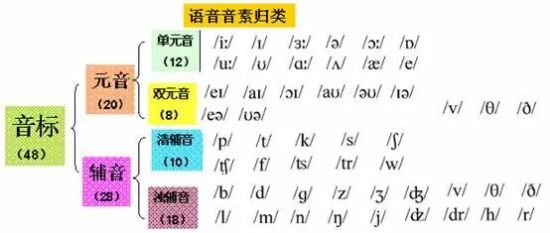
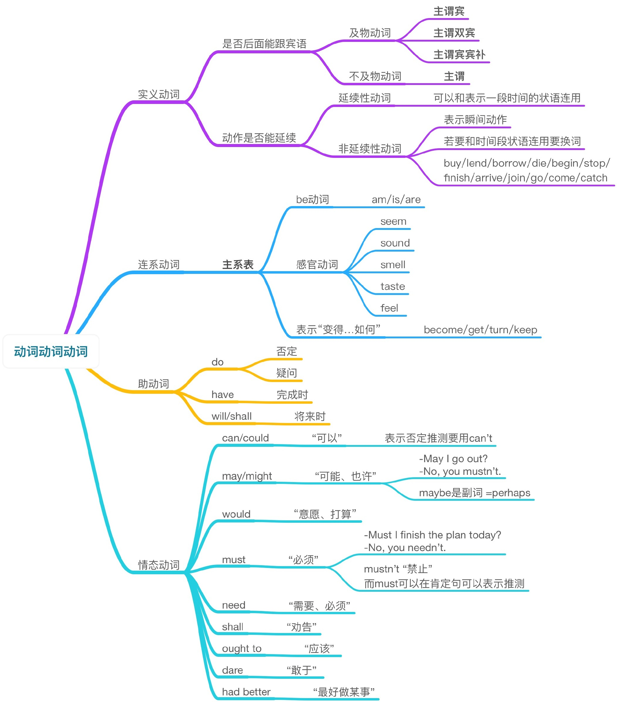

### everyone和every one和individual

everyone是一个词(代词)，只用来指人，等于everybody，在它后面不能跟介词of 

every one是两个词，既可用来指人，也可用来指物，等于each one，**后面可跟介词of**。

>  eg1.   
> Not everyone likes this book.并不是每个人都喜欢这本书。     
> eg2.   
> Every one of the family has a car.家里每个人都有车。

每人  
every one must receive 9 years of compulsory education   
每人必须接受九年的义务教育.

人人都  
not every one can succeed .不是人人都会成功的。

### which可以用作单数也可以用作复数

---

### 英语词组与英语短语其实是一样的吗?只是说法不同?

用户都认为优质的答案:

> 差不多的意思.不过词组一般是动词词性,比如apply for ,appriciate to等
> 	
> 短语一般是形容词或名词词性,比如dead tired（很累很累）,Adam's apple等

======以下答案可供参考======

**供参考答案1:**

应该是一样的吧 有必要分得那么清吗 貌似没什么意义

**供参考答案2:**

短语包括词组

### 区分介词短语和动词短语

* 介词短语以介词开头 in front of , at the end of  
* 动词短语以动词开头 take care of , look into

### 不定冠词 a 和 an

不定冠词有a和an两种  
a用于辅音音素开头的词前，an用于元音音素开头的词前

#### 用法  

> 1. 以元音字母a、e、i、o、u开头且发元音音素的单词前用`an `   
> 	例: `an` orange an apple an egg  
> 	
> 2. 以辅音字母开头或首字母不发元音的单词用`a`  
> 	例：`a` banana a pear

**上面两条规则是错误的**

#### 要确定发音首字母,有些单词首字母不发音,比如 hour,honest 

### 所以说,最后,还是看首个音标发音?

---

* a European `[jʊərəˈpiːən]`
* an umbrella； `[ʌmˈbrɛlə]`
* a university `[juːnɪˈvəːsɪti]`
* an aversio`[ əˈvəːʃ(ə)n]`
* an honest girl `[ɒnɪst]`
* an apple `[ap(ə)l,ˈæpəl ]`

### trace、track、trail三个词都是踪迹、追踪的意思，有什么区别

* trail：它的本意是拖在后面的意思，是指根据痕迹进行追踪，这里的痕迹可以是血渍、脚印、车辙，气味、烟等。  
* track ：它的本意是足迹、轨道，是指根据痕迹进行追踪，这里的痕迹一般是脚印、车辙，不包括气味等。  
* trace：它的本意.追寻、追溯、回溯，是根据事件影响的结果，如战争留下的痕迹，向回追溯。  

## 情态动词和情态助动词

助动词与情态动词最主要的区别之一是  
**助动词本身没有词义,而情态动词则有自己的词义,能表示说话人对有关动作或状态的看法,或表示主观设想**
 
 情态动词举例:
 
>  can (could), may (might), must, need, ought to,used to, dare (dared), shall (should), will (would) .

【1】**情态动词(modal verb)：** 只能当作情态动词使用的动词。  
例如：can/could/ must/ought to /used to /had better /may/might

【2】**情态助动词(modal auxiliary)：**不仅可以当作情态动词使用还可以当作助动词使用  
will/would;shall/should/

> I will do anything for you.（情态动词用法）  
> （情态动词+动词原形表示一种意愿，愿意）
> 
> I will go to Beijing tomorrow.(助动词用法）  
> （助动词will+动词原形帮助构成一般将来时态）

【3】特别备注：但是有些语法书也说，情态动词即就是情态助动词.因此，要看你按照那种方式去理解了.

### 明显, 情态动词包括情态助动词 动词包括助一切情态动词或助动词,这样想的话,可忽略上述1,2,3规则

---

#### 英语中助动词归纳如下：

*  am, is, are , was , were,（帮助变进行时态，帮助变被动语态）
*  do , does, did （帮助句子变疑问句，否定句，强调谓语动词作用）
*  has ,have （帮助句子变现在完成时态作用）
*  had ,（帮助句子变过去完成时态，以及虚拟语气倒装）
*  will , shall  （帮助句子变一般将来时态）
*  would , should （帮助句子变过去将来时态）
*  be going to（帮助句子变一般将来时态）

> 情态助动词包括will（would）shall（should）can（could）may（might）must，need，dare，ought to，used to，had better后接原形不定词

### 协助主要动词构成谓语的词叫助动词（Auxiliary Verb），也叫辅助动词。
助动词可以协助主要动词构成时态或者语态，也可构成疑问句和否定句，构成否定句时与否定副词not连用。

最常用的助动词有：be， have， has， do， does， shall， did， will， should， would等。  
例句：   
> He has made a plan. 他已经订了计划。

上句中has就为助动词，它的作用是帮助构成现在完成时态。

## 补一张英语动词词类的思维导图

[图片来源](http://wangyuanxuesheroyinstitute.lofter.com/post/1d5d1ade_b4a65b4)

### 连系动词和不及物动词

英语动词主要分为实意动词notional verb,系动词link verb,助动词auxilairy verb,and 情态动词modal verb 四大类.

其中实意动词又分为 及物动词（后接宾语）和不及物动词（后面不接宾语）.所以,系动词和不及物动词不是一回事.

系动词也没有被动

- smell
- feel

feel可以当系动词用吗? 可以.

---

### 2018 0820 21:27

## none 和nothing

none指人/物 nothing指物。

none作代词和副词

nothing作代词,名词,和副词

代词前不加限定词

### 代词和名词

名词是表示人,事物,地点或抽象概念的名称。

代词[pronoun简称pron]是代替名词的一种词类

## 限定词

	1. 冠词（article） 定冠词（definite article），不定冠词（indefinite article），零冠词（zero article)
	2. 形容词性的物主代词限定词（possessive pronoun determiner），my，your，his，her，our，their，its. john's，my friend's.
	指示限定词（demonstrative determinative），this，that，these，those，such.
	关系限定词（relative determinative)，whose，which.
	疑问限定词（interrogative determinative），what，which，whose.
	不定限定词（indefinite determinative），no，some，any，each，every，enough，either，neither，all，both，half，several，many，much，(a) few，(a) little，other，another.
	3. 数词（numeral） 基数词（cardinal numeral) 和序数词（ordinal numeral)
	倍数词（multiplicative numeral) 和分数词（fractional numeral)
	4. 量词（quantifier) a lot of，lots of，plenty of，a great deal of，a good deal of，a large amountof，a small amount of，a quantity of，a great number of，a good number of 等。

	

## travel,trip,tour,journey,voyage与outing的用法区别 

####  travel 通常泛指“旅行”,词义广泛,可以指长期、短期的,不论何种目的,不论使用何种交通工具的旅行,尤指长途的海外旅行.在表示抽象意义的“旅行”时也要使用travel.travels用来表示“包括访问几个地方的一次长时间的旅行、国外旅行”,也用来表示“旅行笔记”.

* ①He is traveling in Africa.他在非洲旅行.
* ②He is fond of travel.他喜欢旅行.
* ③Travel is valuable because it gives us a knowledge of foreign peoples.
* 旅行很有价值,因为它使我们了解外国各民族的情况.
* ④He has just returned from his travels.他旅行刚回来.
* ⑤ He wrote a book about his travels.他写了本游记.

####  trip通常指短期的短程的旅行,尤指暂时到外地办理业务上的事情.

* ①Mother took me downtown on a shopping trip.母亲带我进城到商店逛了逛.
* ②We had a trip to the coast last Saturday.上周六我们到海边旅行去了.
* ③He went on a business trip yesterday.昨天他出差了.

####  tour的意思是“周游、巡视”,常带有根据一定的路线,事先预定了一些逗留地点,最后仍回到出发地.

* ①He is planning a tour of the world.他计划周游世界.
* ②He visited the countries on good-will tours.他对一些国家进行了友好访问.

####  journey 表示“旅行,旅程”,适用范围广,多指陆上旅行.不用于指距离很短的旅行.

* ①He is away on a journey.他出门旅行去了.
* ②It's a long journey from here to the city.从这儿到那个城市路途遥远.
* ③Wish you a good journey.祝你一路平安.

#### voyage多指“乘船作海上旅行”.

* ①we had a good voyage.我作了一次美妙的航行.
* ②He made a voyage to America.他航行去美国.

#### outing表示“出游,户外活动”.
* ①We went on an outing yesterday.昨天我们去远足.
* ②They went to go on an outing to seaside.他们想到海滨玩玩.

### consider 

作及物动词时候的被动语态 considered   
作形容词时候 considered  
形式一样,不要搞混

> Is it true that the American intellectual is rejected and considered of no account in his society?

###  Be+过去分词+ 介词”结构 

* be devoted to   

* be impressed with   
* be accustomed to  
* be equipped with  
* be lost in 

* be buried in 
* be absorbed in 
* be occupied with 
* be engaged in 
* be based on 
* be involved in 
* be exposed to 

* be connected with 
* be related to 
* be made in be made of/ from 
* be trapped in 
* be stuck in 
* be caught in 
* be dressed in 
* be seated at/in/on 
* be set in 
* be aimed at 
* be attached to 
* be surrounded with/by 
* be covered with/by

* be addicted to 
* be filled with 
* be crowed with 
* be admitted to/into 
* be made up of 
* be known for 
* be known as 
* be tired of 
* be intersted in 
* be pleased with 
* be surprised at 
* be worried about 
* be concerned about 
* be disapointed with 
* be satisfied with 
* be fed up with 
* be faced with 
* be located/situated in 

## 过去式,过去分词,被动语态,动词作形容词

过去式是一个动词，单独作谓语。不与助动词、情态动词连用。它的词性与动词的第三人称单数一样。 

过去分词表的意义是被动或完成。 

而过去式和过去分词最主要的区别是：过去式是一个动词，而过去分词是一个动词的非谓语形式，相当于一个形容词

被动语态 = be + 过去分词

## many much some 

* many 很多,修饰可数名词
* much很多,修饰不可数名词
* some一些,修饰可数或不可数名词(any用在疑问句和否定句)

## 现在分词和现在进行时

这两个是不同的概念!

**现在进行时**需要有be动词,是时态,表示某物正在做什么,强调正在做:

She is looking for her dress.   
We are moving to a new house.

> is looking/are moving是 现在进行时

**现在分词**作形容词用,例子 :   
The news is disturbing.

> 以上的说法有些片面, disturbing这个现在分词和interesting,disgusting一样,通常作形容词用,并不代表`所有现在分词`都作形容词用

实际上,现在分词是是现在进行时的一部分

## either和neither

#### neither: 一般情况下,指两者都不

I don't like him — neither do I

I don't know — me neither

neither is suitable
两个都不合适

neither of them can drive
他们两个都不会开车

#### either: 一般情况下,指两者中任意一个

take either road
两条路随便走哪一条

which book do you want? — either

I can't sleep — I can't, either
我睡不着──我也睡不着

there's no answer to that question either
那个问题也没有答案

> 但作为副词使用的时候,两个单词的意思差不都,都表示`也不`