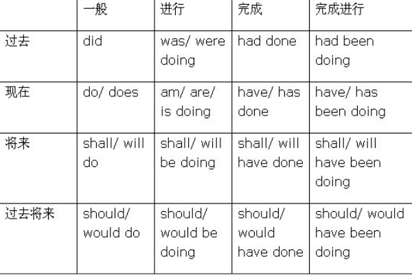
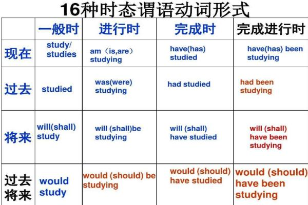

It's been a hard year.

### has been

has been是动词be的现在完成时形式，当主语为第三人称单数时，用has been的形式。

has been的意思是“已经”，例如：She has been in her room for hours.（她已经在自己的房间里待了几个小时。）

2.Julian has been thinking up new ways of raising money.

朱利安想出了不少筹款的新办法。

3.The area has been the scene of fierce fighting for three months.

这一地区3个月以来不断发生激战。

4.He has been in the abyss of despair.

他已陷入绝望的深渊。

5.My friend has been in Israel for three months.

我的朋友在以色列呆了有三个月了。

## 谓语动词16种时态

### 句型

1.去过 have/has been to

2.去了 have/has gone to

3.一直在 have/has been in,at

例如
 
他去过香港上三次   He has been to HongKong for three times.

他去了香港   He has gone to HongKong.

他在香港三年了 He has been in HongKong for three years.

