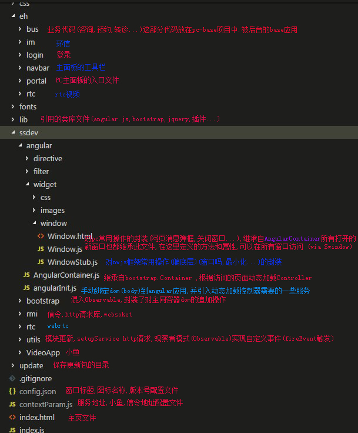
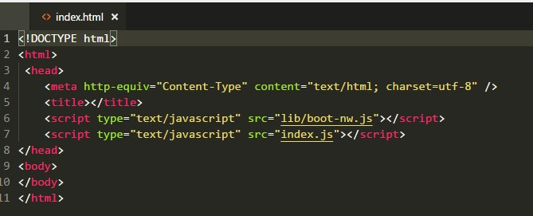
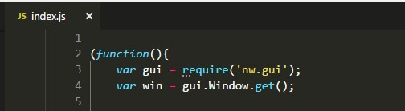
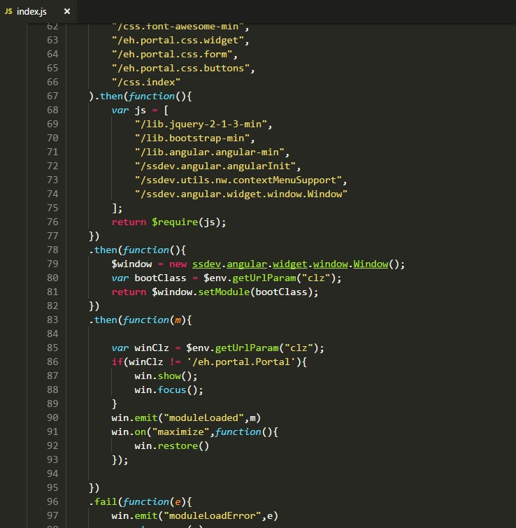

## 项目构成

- ehealth-pc
- ehealth-pc-base 

## 用到的框架
- nwjs(node-webkit),参考nwjs文档
- angular.js + 内部框架,动态加载控制器
- bootstrap + jquery

## 目录结构



## 启动过程

#### 加载index.html


#### index.js 代码





1. 每个窗口打开都会先加载index.html
1. 在index.html中同步加载boot-nw.js 和 index.js
1. index.js中将基础的css和js文件加载好以后,通过`ssdev.angular.widget.window.Window()`实例化新的自定义window对象(不是指真正的浏览器窗口)
1. 将window.html里的dom元素追加到index.html的body中
1. 通过`window.setModule`方法获取html和js,创建相应的模块,追加到div.widget-body中


**主窗口以外的窗口,是通过windowStub文件的show方法中打开的,此文件封装了nw的一些常用接口**

## 窗口中共享变量

##### load事件中传递

    win.on("loaded", function () {
        win.window['$AppContext'].urt = $AppContext.urt;
        win.window['$AppContext'].notLogonCallback = $AppContext.notLogonCallback;
        win.window['$AppContext'].serverDate = $AppContext.serverDate;
        win.window['$AppContext'].exInfo = $AppContext.exInfo;
        //...
       
    });


## 事件传递

#### 1 在父模块中监听事件,在子模块中fireEvent拋事件,传递参数

          $create(conf.url, conf).then(function (m) { 
                if (mid == "home") {
                    m.on("moduleClick", function (moduleData) {
                     //...
                    });
                }
            })
            
在子模块中

        me.fireEvent("moduleClick",data)

##### 2 在父窗口中

            stub.on("moduleLoaded", function (form) {
        
				form.on("refreshList", function () {                   
                    me.loadListData(me.currentCnd);             
                });
				
         
            })
子窗口中

    me.fireEvent('refreshList');

## 调试
		//获取nw模块
		var gui = require('nw.gui');
		//获取窗口对象
		var win = gui.Window.get();
		//打开调试窗
		win.showDevTools();

**具体可参考nwjs文档**

## 常用方法

$create 创建新模块


afterInitComponent() 加载模块html完毕执行的函数

initController() 动态加载控制器,将依赖注入

```javascript
	initController:function(func){
		var app = angular.module('app');
		var ctrlId = app.createCtrlId();
		var el = this.el
		
		el.attr("ng-controller",ctrlId)
		
		// 为模块注册新的控制器
		app.controllerProvider.register(ctrlId,func)
		
		//以使用注入器的invoke()方法将服务注入所依赖的服务对象,执行自定义函数
		app.injector.invoke(function($compile, $rootScope) {
			// 为$rootScope创建一个新的scope
			var scope = $rootScope.$new(true);
			// 通过$compile服务可以编译html字符串或dom对象或jqLite对象，然后得到一个编译函数，再传入$scope，就会在当前作用域进行编译
		    $compile(el)(scope);
		    scope.$apply();
		});
	}
```

---


refresh() 主动更新数据到视图

ssdev.angular.widget.window.WindowStub 在窗口中打开新模块

$window.showMask() 显示loading框

$window.showModal() 显示模态框

$window.showTip() 错误提示(自动隐藏)

$window.showErrorMsg() 错误提示

$env.nodemain.** 访问background.js中的方法,该文件相当于nwjs的后台进程
