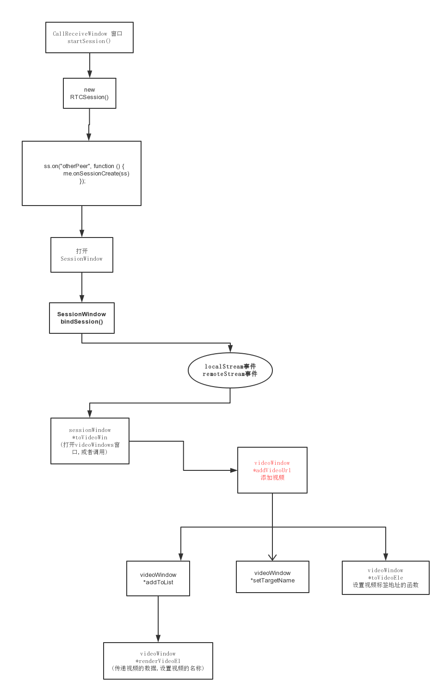

# webrtc

> WebRTC，网页实时通信（Web Real-Time Communication）的缩写，是一个支持网页浏览器进行实时语音对话或视频对话的技术

## 技术要求

### 客户端

- 支持webrtc的HTML5浏览器

### 服务器端:

- 信令服务器(Signaling Server)- 
- NAT穿透服务器(ICE Server)。

**呼叫和接收呼叫使用的是websocket技术**

### pc从点击接收视频请求之后的大致流程图

