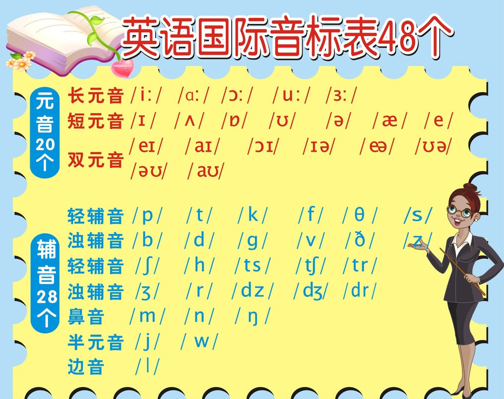
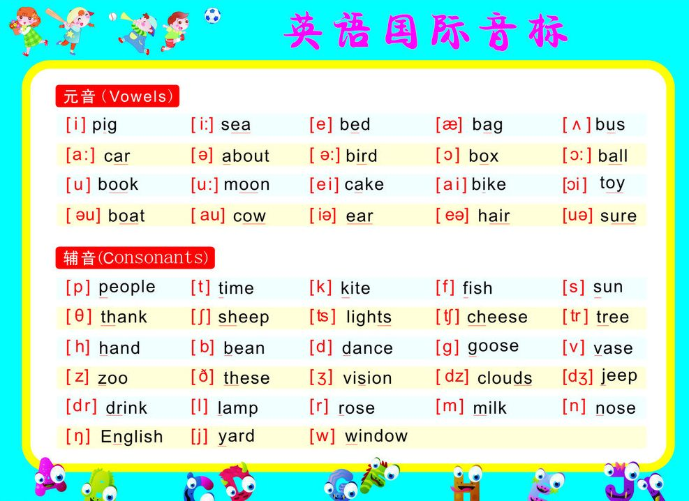
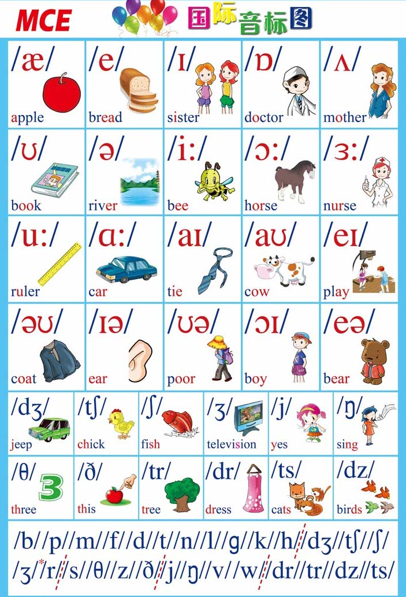

# phonetic-symbol

英语有26个**字母**

元音只包括`a e i o u`这五个字母,其余的都为**辅音**.

`y`是半元音 半辅音字母,但在英语中都把他当作辅音.

### 音标的话,包括:

元音20个,辅音28个

	

---
再附一张带插图的

> * tr (戳）  
> * dr（捉）   
> * ts（此）  
> * dz（子）
> * /ʒ/ (日,介于之 和  日 之间的发音?)
> * /dʒ/ (枝)
# 关于元音和辅音

> 1. 从发音语音学的层面上讲，元音就是发声时`(口腔或者咽喉)`不受阻碍发出的音，而辅音就是发声时`(口腔或者咽喉)`受阻碍发出的音。
> 1. 从声学语音学的层面上讲，元音就是声波图谱上有共振峰的音，而辅音是在声波图谱上没有共振峰的音。
> 2. 从音系学的角度来讲，元音就是一个音节中音高和音强处于顶点 (peak) 的那个音，其余的音均为辅音。
> 1. 不要元音或者不要辅音我们都能够发出独立的、清晰可辨的、可传达简单信息的音节，但是元音和辅音的结合及其变换才能够形成满足多样化表意的人类语言。
> 1. 我们见到的绝大部分音节之所以采取声母- 韵头韵中- 韵尾 (Onset- Rhyme- Coda)的结构，主要是因为这样中间高、两边低的音阶，在发音过程中相对省力。

[https://www.zhihu.com/question/21881798](https://www.zhihu.com/question/21881798)

---
> 没辅音喘死，没元音憋死
> 
> 没辅音的赶脚就像忐忑的头两句：啊~哦 啊~噢诶

---

> 1、元音是响音，主要作用是让人听得见。
> 
> 2、辅音（绝大多数）是不响音，主要作用是提高辨识度，即让人听得懂。
> 
> 3、元音和辅音的交替使用，不仅可以让人听得见、听得懂，更重要的是，可以让人可以说得久。

